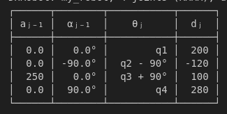
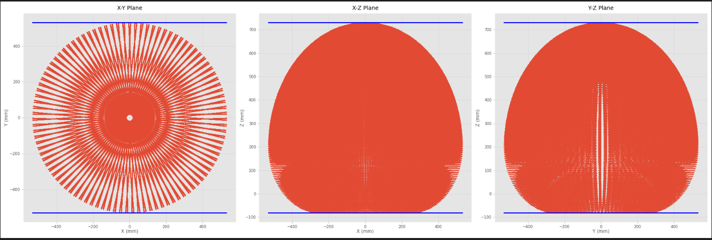
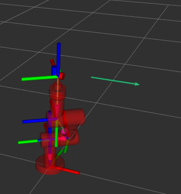
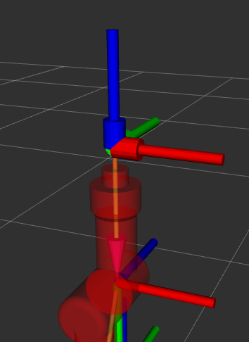
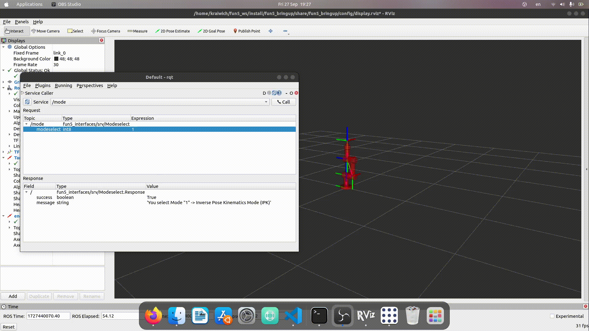
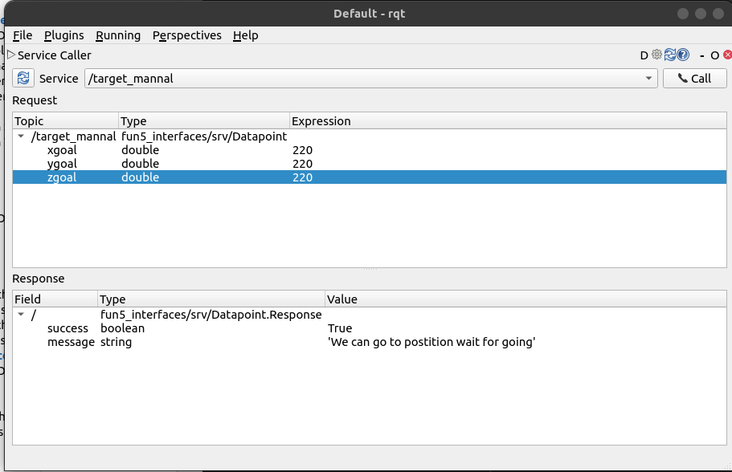
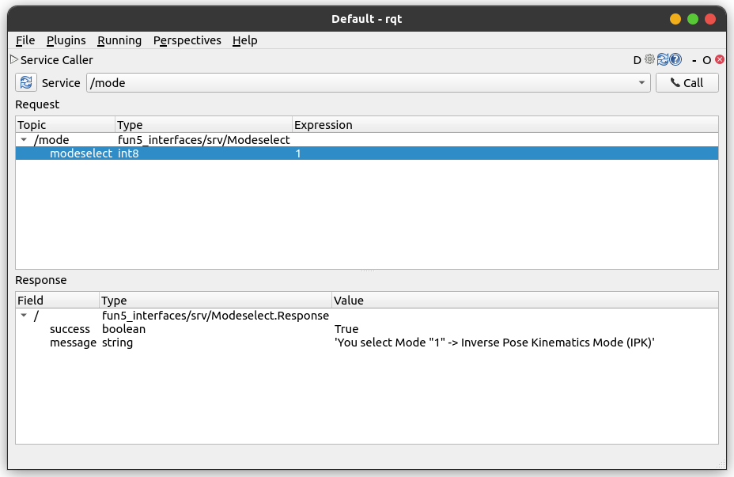
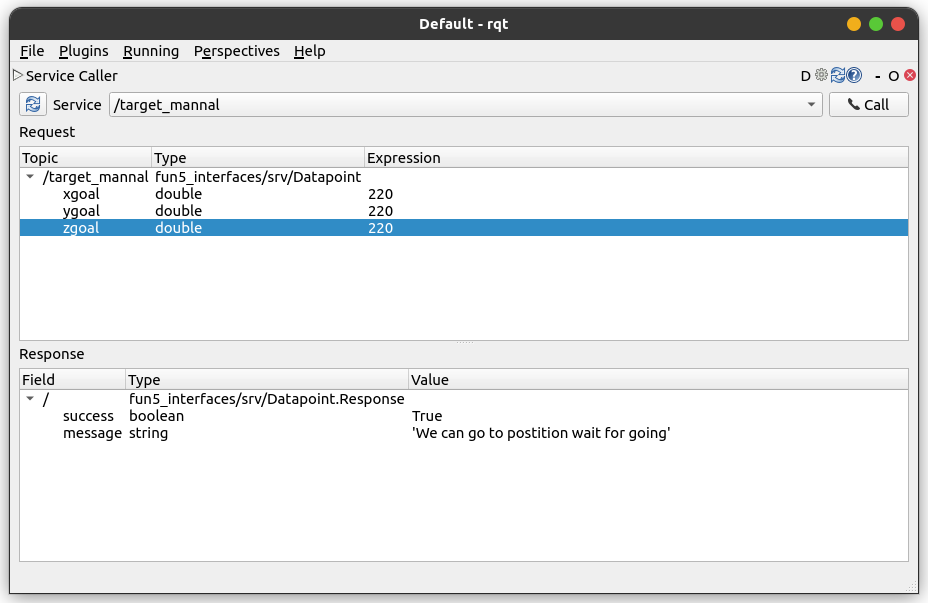
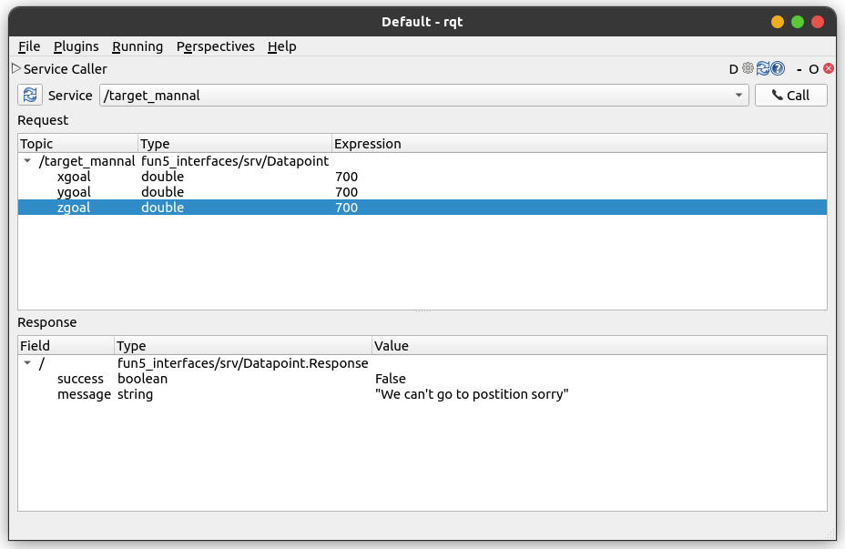

# FUN4: Hello world

ทำออกแบบระบบที่ใช้ในการควบคุมแขนกล 3 DOF

## Part 1 Descriptiion

### Part1.1 ทำการหา WorkSpace
เราจะหา workspace ของหุ่นที่กำหนดโดยการสร้าง DHParameter จากรูป cad หุ่นที่เราได้มา





เราได้สร้างcode ที่ใช้ในการหา WorkSpace โดยนำ Code จาก HW2_Kinematic มาดัดแปลงและนำมาใช้งาน
(Folder อยู่ใน fun5_ws/src/Python_Proof/find_ws_and_test.ipynb)


เราได้ทำการหาค่าสูงสุดที่หุ่นเราสามารถเคลื่อนที่ได้จากการ plot รูป



เราจะได้ค่า Max, min ของแต่ละตัวมาได้ดังนี้
และเราได้ทำการเก็บค่าตำแหน่งทุกจุดที่ได้ใน WorkSpace มาเก็บไว้เป็นไฟล์ CSV (ตอนแรกผู้จัดทำจะใช้ yaml แต่เนื่องจากค่าเยอะเกินไปทำให้อ่านไม่ได้... เลยเปลี่ยนมาใช้ CSV)

และเราก็ได้นำ CSV ที่ได้จาก Python_Proof ไปไว้ใน /fun5_bringup/config/workspace_points.csv

### Part1.2 ทำการสร้าง Node สุ่มเป้าหมายปลายมือ
หลังจากที่หา Workspace ของแขนกลเราได้ เราจะทำการสร้าง Node ที่ Random จาก workspace ที่เราเก็บไว้ และส่งผ่าน Topic 
```topic
/target (msg type : PoseStamped)
```
และแสดงผลผ่าน RVIZ2




### Part1.3 ทำการส่งตำแหน่งปลายมือแขนกล

ส่งต่ำแหน่งปลายมือของแขนกลผ่าน Topic 
```Topic
/end_effector (msg type : PoseStamped)
```
และแสดงผลผ่าน RVIZ2





ตำแหน่งปลายมือมาจากเราหา FK จาก Q ต่างๆใน Controller node ของเรา
## Part 2 Descrption

### Controller
แขนกลจะสามารถควบคุมได้ 3 mode ได้แก่ Inverse Pose Kinematics Mode (IPK), Tele-operation
Mode (Teleop) และ Autonomous Mode (Auto)

ตัว Controller เราได้มีการสร้าง Mode อยู่ 4 Mode ด้วยกันได้แก่
* 0 is Not ready
* 1 is Inverse Pose Kinematics Mode (IPK)
* 2 is Tele-operation Mode (Teleop) (ทำไม่เสร็จ)
* 3 is Autonomous Mode (Auto)

และ State อยู่ 2 State ได้แก่
* 0 is ready
* 1 is Working

และเราได้สร้าง Service ที่ใช้คุยกันระหว่าง Node ควบคุมและเช็คต่าง ๆ 

* /mode ใช้สำหรับการเปลี่ยน Mode ของตัวแขนกล



* /target_mannal ใช้สำหรับการส่งค่าตำแหน่งที่จะให้ End_effector ไปโดยเราจะกรอกลงไปผ่าน RQT



* /checkcontroller_state ใช้เช็คว่า Controller ของเรากำลังทำงานอยู่หรือไม่

* /checkmode_state ใช้เช็คว่า Controller เรากำลังอยู่ใน Mode ไหน

## Usage

1. Clone Project from github
```git clone
git clone https://github.com/ThepokKung/fun5_ws.git
cd fun5_ws 
```
2. Build Project
```colon build 
colcon build --parallel-workers 2 
```
(--parallel-workers เพื่อเพิ่ม CPU ในการประมวลผล ตอนรันครั้งแรกจะประมวลไม่ทันแล้วคอมค้าง จะใช้หรือไม่ใช้ก็ได้) 

3. Sourcs Project
```source project
source install/setup.bash 
```

4. Launch Project
เปิดใช้งาน
```launch 
ros2 launch fun5_bringup fun5_bringup.launch.py
```


5. วิธีการใช้งาน
เราจะเรียกใช้งาน 
```
rqt
```
เพื่อใช้งานตัวระบบควบคุมแขนกลของเรา
ทุกครั้งเมื่อเราเปิดจะอยู่ที่ Mode 0 เราต้องใช้ Service Caller ที่ 
```
Service : /mode
```




ตรงนี้เราจะเลือกได้แค่ Mode 1 และ 3 เท่านั้้น
เนื่องจาก Mode อยู่นอกเหนือความเข้าใจผมไปมากจนไม่สามารถเขียนโปรแกรมให้ได้

### Mode 1

ตอนที่อยู่ที่ Mode 1 จะสามารถส่ง ตำแหน่งที่เราต้องการจะไปได้ จะมีผลลัพท์ส่งกลับมาว่าไปได้หรือไม่ โดนยจะส่งผ่าน 
```
service : /target_mannel
```





### Mode 3

Mode 3 นี่จะรับค่ามาจาก Randomtarget_node.py ที่จะเป็นตัวที่ซุ่มตำแหน่งจาก CSV ของ Workspace ที่เราเก็บเอาไว้มาส่งค่าให้ตัวหุ่นของเรา


## ผู้จัดทำ

65340500004 ไกรวิชญ์ วิชาโคตร - [@ThepokKung](https://www.github.com/ThepokKung)

